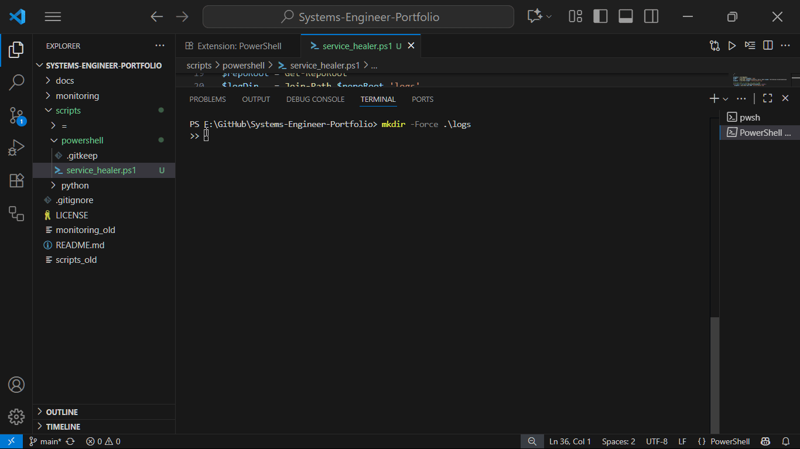

# Systems-Engineer-Portfolio

> A practical Systems Engineer portfolio combining monitoring, automation, and cloud operations with ITIL-based structure.

This project is designed as a portfolio showcase for Systems Engineer roles, demonstrating practical skills in enterprise infrastructure support, monitoring, automation, cloud services, and ITIL-aligned operations.

Portfolio highlights include:

 - ITIL processes and service management

 - Monitoring & observability with Prometheus, Grafana, and Azure Monitor

 - Infrastructure-as-Code with Terraform (Azure & VMware)

 - Automation with PowerShell DSC and Python scripts

 - Security, backup, and redundancy strategies

## Getting Started
Clone the repository:

 To clone and explore locally:
  git clone https://github.com/Cellous/Systems-Engineer-Portfolio.git
  cd Systems-Engineer-Portfolio

 Requirements:

  - Docker (for Prometheus/Grafana monitoring stack)

  - Python 3.9+

  - PowerShell 7+

  - Terraform CLI
Use PowerShell or Bash to run setup scripts inside `/scripts` for initializing the demo environments.
 
## Key Skills Demonstrated

 - ITIL Service Management – Incident, Request, Problem, and Change processes

 - Infrastructure-as-Code (IaC) – Azure Monitor & VMware vSphere via Terraform

 - Monitoring & Observability – Prometheus + Grafana dashboards, Azure Monitor workbooks

 - Automation – PowerShell DSC, backup scripts, and Python synthetic checks

 - Security & Compliance – CIS baselines, backup/restore scripts, redundancy planning

 - Networking & Performance – TCP/IP diagnostics, packet captures, bottleneck simulations
 
### Technologies Used
- **Languages:** Python, PowerShell, YAML
- **Tools:** Terraform, Docker, Grafana, Prometheus, Azure Monitor
- **Cloud/Infra:** Azure, VMware vSphere, Citrix
- **Frameworks:** FastAPI (for ITSM mini-app)gies Used

## Repository Structure
/docs               → Architecture diagrams, ITIL runbooks, PIR templates
/monitoring         → Prometheus + Grafana stack (docker-compose)
/itsm               → FastAPI mini ITSM system + CLI tools
/scripts
   ├─ powershell    → Service healers, backup scripts
   └─ python        → Synthetic checks, Citrix telemetry parser
/iac
   ├─ azure         → Terraform configs (VMs, Log Analytics, Monitor)
   └─ vmware        → Terraform vSphere configs, Packer templates
/security           → CIS baselines, key vault templates
/backup             → Snapshot + verify scripts

## Evidence Matrix

| Job Requirement | Repo Evidence |
|-----------------|---------------|
| Manage & monitor systems | `/monitoring/*`, Grafana dashboards, Azure workbooks |
| Daily ITSM usage | `/itsm/*`, `/docs/runbooks` |
| OS install/config/maintain | `/scripts/powershell`, DSC |
| Proactive performance & availability | `/scripts/python/synthetic_checks.py` |
| Security, backup, redundancy | `/backup/*`, `/security/*` |
| Automation/scripting | `/scripts/powershell`, `/scripts/python` |
| Citrix performance tuning | `/scripts/python/hdx_telemetry_parser.py` |
| Azure & VMware experience | `/iac/azure/*`, `/iac/vmware/*` |
| Networking knowledge | `/docs/networking/*`, iperf & packet capture notes |

## PowerShell Automation – Service Healer Script

This PowerShell automation script (service_healer.ps1) monitors a Windows service and automatically restarts it if it stops responding.
It demonstrates proactive system monitoring, recovery automation, and logging — valuable for enterprise operations and DevOps portfolios.

### How to Run the Script
1. Open the project folder in VS Code
cd F:\GitHub\Systems-Engineer-Portfolio
code .

2. Run the PowerShell script
pwsh -File scripts\powershell\service_healer.ps1 `
  -ServiceName Spooler `
  -IntervalSec 10 `
  -MaxRestarts 2 `
  -MaxDurationSec 60

| Parameter |	Description |
|-----------|-------------|
| ServiceName	| Windows service to monitor (e.g., Spooler, wuauserv, LanmanWorkstation)|
| IntervalSec |	Check frequency in seconds |
| MaxRestarts	| Number of restart attempts before giving up |
| MaxDurationSec |	Time limit before automatic stop |
3. Stop the script

Press Ctrl + C in VS Code’s terminal to stop monitoring.

4. View the log file
Get-Content .\logs\service_healer.log -Tail 20

### Example Output
2025-10-06 16:29:12Z CPU: 2.1% FreeMem: 1068MB Spooler=Running
2025-10-06 16:29:27Z CPU: 2.3% FreeMem: 1066MB Spooler=Running
2025-10-06 16:29:42Z CPU: 2.2% FreeMem: 1067MB Spooler=Running
2025-10-06 16:29:57Z CPU: 2.5% FreeMem: 1065MB Spooler=Running
2025-10-06 16:30:12Z CPU: 3.1% FreeMem: 1064MB Spooler=Running
Reached MaxDurationSec=60. Exiting.
- Logs CPU %, memory (MB), and current service status every IntervalSec.
- Automatically restarts the service if it goes to Stopped or Paused state.
- Saves all logs to .\logs\service_healer.log for review.
- 

  
### Features Demonstrated

- Monitors Windows service health and uptime

- Logs CPU and memory usage snapshots

- Attempts automated recovery with restart limits

- Implements clean exit and transcript logging

### Screenshots (Coming Soon)
- Grafana dashboards – visualizing system health metrics from Prometheus exporters  
- ITSM FastAPI app – simple incident ticketing prototype  
- PowerShell service healer – automated recovery script demo
 
 ## License
 This project is licensed under the MIT License – see the `LICENSE` file for details.
 
---
### Connect
- LinkedIn: [Marcellous Searcy](https://www.linkedin.com/in/marcellous-searcy)
- GitHub: [@Cellous](https://github.com/Cellous)
- Email: marcelloussearcy@yahoo.com

